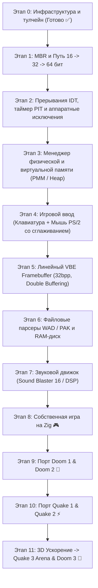

<div align="center">

# 🎮 Hollis-Bit's OS
### *A Bare-Metal Gaming Operating System built with x86_64 Assembly & Zig*

[](https://ziglang.org/)
[](https://nasm.us/)
[]()
[](https://www.qemu.org/)
[]()
[](LICENSE)

<br/>

> **Hollis-Bit's OS** — специализированная операционная система, создаваемая с нуля для запуска собственной нативной игры и легендарной классики компьютерных игр. 
> Мы проходим всю эволюцию архитектуры процессоров своими руками: **от 16-битного реального режима через 32-битный защищенный до современного 64-битного Long Mode**.

</div>

---

## 🎯 Игровые цели (Gaming Targets)

| Игра / Движок | Технология | Описание |
| :--- | :--- | :--- |
| 🎮 **Своя игра на Zig** | Кастомный движок | Нативная игра (псевдо-3D Raycaster или 2D арена), работающая напрямую с ядром без фоновых лагов |
| 👾 **DOOM 1 & DOOM 2** | `doomgeneric` + C Shim | 2.5D софтверный рендерер (320x200), парсинг `.WAD`, 35 FPS, SB16 звук |
| ⚡ **QUAKE 1 & QUAKE 2** | 3D Software Rasterizer | Настоящее 3D, BSP-деревья, Z-буфер, обзор мышью (mouselook), парсинг `.PAK` |
| 🚀 **QUAKE 3 & DOOM 3** | OpenGL / TinyGL / virtio-gpu | 3D конвейер, аппаратное/программное ускорение движков id Tech 3 и id Tech 4 |

---

## 🏛️ Архитектурное разделение труда

```
       +-----------------------------------------------------------+
       |                  Hollis-Bit's Gaming OS                   |
       +-----------------------------+-----------------------------+
                                     |
              +----------------------+----------------------+
              |                                             |
   ⚡ [ASM КОСТЯК ЯДРА]                           🧠 [ZIG МОДУЛЬ]
  - 16-бит MBR (0x7C00)                         - Менеджер памяти (Heap/PMM)
  - Переход: 16 -> 32 -> 64 бит                 - Парсеры .WAD и .PAK архивов
  - Таблицы страниц (PML4)                      - Игровой движок и математика
  - Прерывания (IDT / PIC)                      - C-Runtime слой совместимости
  - Переключение контекста (ASM)                - Софтверный рендерер кадра
  - Драйверы портов ввода-вывода
```

---

## 🗺️ Дорожная карта разработки



---

## 📂 Структура проекта

```
.
├── src/
│   ├── boot/
│   │   └── boot.asm      # 16-битный MBR загрузчик (0x7C00), BIOS int 10h/13h
│   ├── kernel/
│   │   ├── entry.asm     # 64-битная точка входа ядра на чистом ASM (_start)
│   │   └── main.zig      # Тяжелая подсистема логики на Zig (zig_heavy_init)
│   └── linker.ld         # Скрипт компоновщика: разметка ядра с адреса 1 МБ
├── build.zig             # Нативная система сборки Zig 0.16
├── Makefile              # Сборка через GNU Make
├── run.sh                # Автоматический скрипт сборки и запуска в QEMU
├── LICENSE               # Лицензия MIT
└── README.md
```

> **Особенность кода:** Все файлы снабжены лаконичными и понятными комментариями к смысловым блокам, объясняющими работу низкоуровневого железа и архитектуры.

---

## ⚡ Быстрый старт

### Требования
- **NASM** (ассемблер)
- **Zig** (версия 0.16.0+)
- **QEMU** (`qemu-system-x86_64`)

### Запуск (Любой из способов)

1. **Через универсальный скрипт:**
   ```bash
   chmod +x run.sh
   ./run.sh
   ```

2. **Через систему сборки Zig:**
   ```bash
   zig build run
   ```

3. **Через Makefile:**
   ```bash
   make run
   ```

---

<div align="center">
  <sub>Создано с любовью к низкоуровневому программированию и классическим играм ❤️</sub>
</div>
